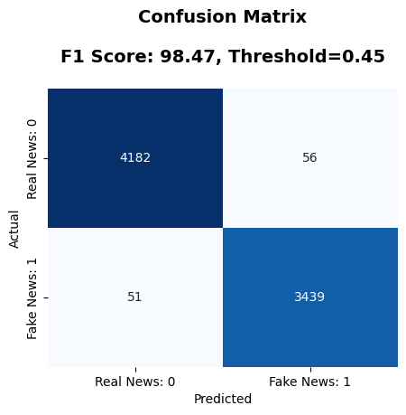
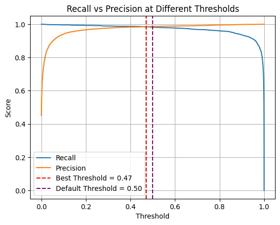

# Veritas: News Credibility Analyzer

Advanced ML system with risk assessment, pattern analysis, and explainable AI for news verification using Text and Metadata. 

---

## Table of Contents

- [Overview](#overview)
- [Key Features](#key-features)
- [Live Frontend & API Access](#live-frontend--api-access)
- [How It Works](#how-it-works)
- [Technical Stack](#technical-stack)
- [Use Cases](#use-cases)
- [Model Evaluation Result](#evaluation-results)
- [Exploratory Data Analysis (EDA) Summary](#exploratory-data-analysis-eda-summary)
- [Important Disclaimer](#important-disclaimer)
- [Getting Started](#getting-started)
- [Docker Deployment](#docker-deployment)
- [Repo Structure](#repo-structure)
- [Contributing](#contributing)
- [License](#license)
---

## Overview

Veritas is a comprehensive news credibility analysis platform that leverages advanced machine learning techniques to detect fake news and provide transparent explanations for its predictions. The system combines content analysis, pattern recognition, and explainable AI to help users make informed decisions about news authenticity.

---

## Key Features

### Intelligent Analysis
- ML-Powered Detection: Advanced classification using trained models to identify fake vs. real news
- SHAP Explainability: Transparent decision-making with feature importance rankings
- Pattern Recognition: Analyzes writing style, linguistic patterns, and content structure

### Defensive Programming
- Lorem Ipsum Detection: Catches placeholder text before expensive ML processing
- Character Repetition Filtering: Identifies suspicious repetitive patterns
- Special Character Validation: Monitors unusual character usage ratios
- Early Issue Detection: Prevents obvious problems from reaching the ML model

### Risk Assessment
- Severity Levels: High, Medium, Low risk categorization
- Confidence Scoring: Numerical confidence ratings (0-100%)
- Reliability Metrics: Comprehensive credibility scoring system
- Risk Indicators: Identifies specific patterns that raise concerns

### Interactive Visualizations
- SHAP Summary Plots: Visual feature impact analysis
- Text Pattern Charts: Graphical representation of writing patterns
- Decision Factors: Clear visualization of prediction reasoning
- Feature Analysis: Detailed breakdown of model decision factors

### Professional Features
- Text Statistics: Word count, sentence analysis, readability scores
- Content Metrics: ALL CAPS usage, punctuation patterns, URL detection
- Export Capabilities: Save analysis results for further review
- History Tracking: Monitor analysis patterns over time

---

## Live Frontend & API Access

### Streamlit Frontend

Access the interactive web application here: [https://veritas-news-analyzer.streamlit.app](https://veritas-news-analyzer.streamlit.app)

Paste or upload a news article and receive:
- Credibility prediction (Real or Fake)
- Risk level and confidence score
- SHAP-based explanation and key features

### FastAPI Backend 

**Access the API** at: [https://veritas-news-analyzer.streamlit.app](https://veritas-news-analyzer.streamlit.app)

| Method | Endpoint   | Description                                 |
|--------|------------|---------------------------------------------|
| POST   | `/predict` | Returns prediction, confidence, SHAP values |
| GET    | `/health`  | Check if the API service is running         |
| POST   | `/analyze` | Full analysis pipeline including risk scoring |


--- 
## How It Works

1. Input Processing: Text is analyzed for basic patterns and defensive checks  
2. Feature Extraction: Advanced linguistic and structural features are computed  
3. ML Prediction: Trained model classifies content as real or fake news  
4. SHAP Analysis: Explains which features influenced the prediction  
5. Risk Assessment: Evaluates overall credibility and assigns risk levels  
6. Visualization: Presents results through interactive charts and summaries

---

## Technical Stack

- Frontend: Streamlit for interactive web interface  
- ML Framework: Scikit-learn for model training and prediction  
- Explainability: SHAP for transparent AI decision explanations  
- Visualization: Matplotlib, Plotly for interactive charts  
- Text Processing: NLTK, spaCy for linguistic analysis

---

## Use Cases

- Journalists: Verify source credibility and fact-check articles  
- Researchers: Study misinformation patterns and linguistic indicators  
- Educators: Teach media literacy and critical thinking skills  
- General Users: Evaluate news authenticity before sharing

---

### Evaluation Results

To assess model performance, we evaluated it on a held-out test set using several classification metrics.

- <strong>Confusion Matrix</strong>: Shows the distribution of true vs. predicted classes
  
  

- <strong>Precision-Recall Curve</strong>: Highlights model performance on imbalanced data
  
  


These plots help assess the model’s capability to distinguish between fake and real news, especially under imbalanced class scenarios. For fair evaluation, we prioritized metrics like **F1-score** and **AUC-PR** over just accuracy.

---

## Exploratory Data Analysis (EDA) Summary

A comprehensive EDA was conducted on the misinformation dataset to uncover patterns and insights critical to model development. The key findings include:

1. **Class Distribution**: Dataset imbalance with more real news than fake, requiring stratified sampling and careful metric selection.  
2. **Subject Distribution**: Perfect correlation with target label presents data leakage risk; excluded from model training.  
3. **Title Length**: Fake news titles are longer and more variable, often sensational or verbose.  
4. **Text Length**: Fake news articles tend to be longer and highly variable; real news is more concise.  
5. **Punctuation Usage**: Exclamation and question marks occur more frequently in fake news.  
6. **Uppercase Words**: Fake news contains more uppercase words for emphasis or sensationalism.  
7. **Temporal Patterns**: Fake news spikes on weekends; real news is more evenly distributed.  
8. **Word Clouds**: Real news uses institutional and factual language; fake news uses emotional and subjective terms.  
9. **Top Unigrams & Bigrams**: Distinct vocabulary reflecting formal reporting in real news and sensationalism in fake news.

These insights informed feature engineering and helped improve model interpretability and fairness.

For the full detailed report, see: [EDA_Report.md](./EDA_Report.md)

---

## Important Disclaimer

Veritas is designed as a supplementary tool for news analysis. It provides guidance based on writing patterns and linguistic features, not absolute truth determination. Users should:

- Always verify information through multiple reliable sources  
- Consider context and domain expertise  
- Use critical thinking alongside automated analysis  
- Understand that no AI system is infallible

---

## Getting Started

1. Clone the repository:
```bash
git clone https://github.com/your-username/veritas-news-analyzer.git
cd veritas-news-analyzer
````

2. Install dependencies:

```bash
pip install -r requirements.txt
```

3. Run the application locally:

```bash
streamlit run app.py
```

---

## Docker Deployment

The application is also containerized for easy deployment. You can pull the Docker image from Docker Hub:

```bash
docker pull kushalregmi61/veritas-news-analyzer:latest
docker run -p 8000:8000 kushalregmi61/veritas-news-analyzer:latest
```

This will start the FastAPI app inside a container accessible at `http://localhost:8000`.

---


---
## Repo Structure
```
misinfo-detector/
├── .gitignore                     # Git ignore file
├── app.py                         # Main streamlit application
├── Dockerfile                     # Docker configuration
├── .dockerignore                  # Docker ignore files
├── LICENSE                        # MIT License
├── output.png                     # Output visualization
├── README.md                      # Project documentation
├── requirements.txt               # Python dependencies
├── api/                           # API-related files
│   ├── dependencies.py            # API dependencies
│   ├── main.py                    # API main entry point
│   └── schema/                    # API schema definitions
├── data/                          # Data directory
│   ├── processed/                 # Processed datasets
│   └── raw/                       # Raw datasets (True.csv, Fake.csv)
├── model/                         # Model artifacts
│   ├── __init__.py                # Package initialization
│   ├── best_params.pkl            # Best hyperparameters
│   └──  model_pipeline.pkl        # Model pipeline
├── notebooks/                     # Jupyter notebooks
│   ├── eda.ipynb                  # Exploratory Data Analysis
│   ├── modeling.ipynb             # Model training and evaluation
│   └── eda.ipynb                  # Additional EDA
├── reports/                       # Analysis reports and figures
│   ├── figures/                   # EDA visualizations
|   ├── evaluatin_metrics/         # evaluation metirices fig 
|   └── eda_report.md              # eda reort 
├── utils/                         # Utility functions
│   ├── model_utils.py             # Model handling utilities
│   ├── predict_output.py          # Prediction utilities
│   ├── nltk_config.py             # config nltk resources
│   ├── nltk_setup.py              # download nltk setup
│   └── preprocessing.py           # Text preprocessing utilities
```


## Contributing

Contributions are welcome! Please refer to the contributing guidelines for:

* Bug reports and feature requests
* Code improvements and optimizations
* Documentation enhancements
* Model performance improvements

---

## License

This project is licensed under the MIT License - see the LICENSE file for details.

---

Built with transparency and rigor to help combat misinformation.


