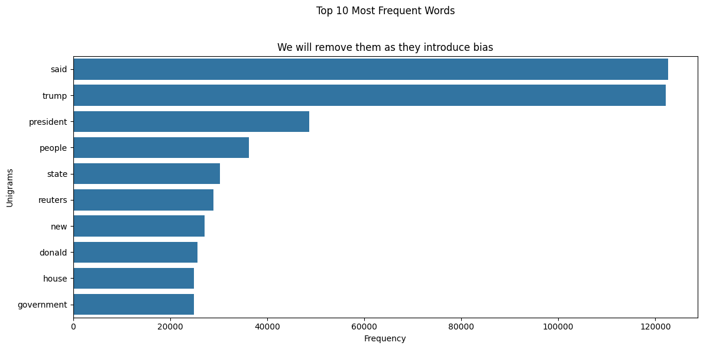

#  Misinformation Detector: EDA REPORT

This EDA explores the linguistic, structural, and temporal patterns that distinguish real from fake news in our dataset. Each section is driven by a guiding question, followed by visual analysis and key insights.

## Dataset Overview

This project uses two primary datasets:

- **True.csv**: Contains news articles labeled as real.
- **Fake.csv**: Contains news articles labeled as fake.

The combined dataset covers articles published between **March 31, 2015** and **February 19, 2018**.

Each dataset includes the following columns:
- **title**: The headline of the news article.
- **text**: The full content of the article.
- **subject**: The topic or category assigned to the article (e.g., politics, worldnews).
- **date**: The publication date of the article.

**Objective**:  
The goal is to analyze and compare the linguistic and structural characteristics of real and fake news articles. Through exploratory data analysis (EDA), we aim to identify distinguishing features and patterns that can be leveraged for building robust machine learning models to detect misinformation.

---

## 1. Data Cleaning & Preparation

**Steps taken to ensure data quality:**
- Removed records with missing or invalid dates.
- Dropped exact duplicates and resolved any label inconsistencies for identical articles.
- Standardized date formats and combined the real and fake news datasets into a single dataframe.
- Engineered additional metadata features:
  - `text_length`: Number of characters in the article body.
  - `title_length`: Number of characters in the headline.
  - `num_exclamations`: Count of exclamation marks in the article.
  - `num_questions`: Count of question marks in the article.
  - `num_uppercase_words`: Number of fully uppercase words in the article.
  - `day_of_week`: Day of the week derived from the publication date.

**Result:**  
A clean, unified, and feature-rich dataset prepared for comprehensive exploratory analysis and modeling.

---

## 2. Class Balance

**Question:**  
*How balanced is the dataset between real and fake news?*

**Plot:**  

**Insight:**  
The dataset is **imbalanced**—real news articles significantly outnumber fake news. This imbalance can bias models toward the majority class.

**Summary:**  
> *Imbalanced data requires careful metric selection (e.g., F1-score) and stratified sampling to ensure fair evaluation and robust model performance.*

---

## 3. Subject Distribution

**Question:**  
*Does the subject/topic of an article correlate with its label?*

**Plot:**  

**Insight:**  
The `subject` feature is **perfectly correlated** with the target label (e.g., some subjects only contain fake or real news).

**Summary:**  
> *This presents a strong risk of data leakage. The `subject` column is excluded from modeling but remains useful for exploratory analysis.*

---

## 4. Title Length Analysis

**Question:**  
*Do fake and real news articles differ in headline length?*

**Plot:**  

**Insight:**  
**Fake news titles** are, on average, **longer and more variable** (mean: 91 vs. 65 characters; std: 24.5 vs. 9.1). Extreme outliers are more common in fake news.

**Summary:**  
> *Sensational or verbose headlines are a hallmark of fake news, likely used to attract attention and drive clicks.*

---

## 5. Text Length Analysis

**Question:**  
*Are fake news articles longer or more verbose than real news?*

**Plot:**  

**Insight:**  
**Fake news articles** are generally **longer and more variable** (mean: 2,549 vs. 2,379 characters; std: 2,201 vs. 1,684), with some extremely lengthy entries.

**Summary:**  
> *Fake news tends to be more verbose and inconsistent, while real news is concise and standardized, reflecting editorial norms.*

---

## 6. Punctuation Usage

**Question:**  
*Do fake news articles use more exclamation or question marks?*

**Plots:**  

---

**Insight:**  
- **Exclamation marks:** Fake news uses them far more (mean: 0.74 vs. 0.06; max: 133 vs. 12).
- **Question marks:** Also more frequent in fake news (mean: 1.23 vs. 0.10; max: 94 vs. 57).

**Summary:**  
> *Frequent use of exclamation and question marks reflects sensationalism and emotional manipulation, making these strong features for classification.*

---

## 7. Uppercase Words

**Question:**  
*Is there a difference in the use of uppercase words between fake and real news?*

**Plot:**  

**Insight:**  
Fake news articles contain **more uppercase words** (mean: 8.4 vs. 6.7; max: 309 vs. 214), with greater variability.

**Summary:**  
> *Uppercase words are often used for emphasis or sensationalism (e.g., “BREAKING”, “SHOCKING”), and are more prevalent in fake news.*

---

## 8. Temporal Patterns

**Question:**  
*Are there patterns in when fake and real news are published during the week?*

**Plot:**  

**Insight:**  
- **Real news** is published more consistently throughout the week.
- **Fake news** spikes on weekends, sometimes surpassing real news counts.

**Summary:**  
> *Fake news may exploit higher social media activity or reduced editorial oversight on weekends. Temporal features can be predictive but risk overfitting and leakage.*

---

## 9. Word Cloud Insights

**Question:**  
*What are the most common words in real vs. fake news?*

**Plot:**  

**Insight:**  
- **Real news:** Institutional, factual, and time-based language (e.g., “White House”, “Reuters”, “Tuesday”).
- **Fake news:** Emotional, subjective, and opinion-oriented words (e.g., “people”, “want”, “think”).

**Summary:**  
> *Fake news relies on emotional appeal, while real news emphasizes facts and institutional reporting.*

---

## 10. Top Unigrams

**Question:**  
*Which single words (unigrams) are most frequent in each class?*

**Plot:**  

---

**Insight:**  
- **Real news:** Focuses on statements, political figures, and institutions (“said”, “trump”, “reuters”).
- **Fake news:** Uses more emotional, subjective, and personality-driven language, with frequent references to political figures and social media.

**Summary:**  
> *Vocabulary differences reflect the intent and style of each class—factual reporting vs. persuasion and engagement.*

---

## 11. Top Bigrams

**Question:**  
*Which two-word phrases (bigrams) are most frequent in each class?*

**Plot:**  

---

**Insight:**  
- **Real news:** Institutional and political phrases (“united states”, “donald trump”, “white house”), direct attribution (“said statement”, “told reuters”).
- **Fake news:** Political figures (“donald trump”, “hillary clinton”), media/image references (“featured image”, “twitter com”), and clickbait phrases (“year old”, “screen capture”).

**Summary:**  
> *Fake news bigrams blend personalities, media, and sensationalism to drive engagement, while real news bigrams emphasize official sources and factual reporting.*

---

## 12. Most Frequent Words 

**Question:**  
*What are the top 10 most frequent words in both fake and real news articles, and how do they impact modeling?*

**Plot:**  
  

**Insight:**  
The top 10 words are mainly political terms "trump" (100K+), "president", "reuters", "donald", "states", "government", "house", "republican", and "united" reflecting the dataset's political focus rather than true linguistic differences between real and fake news.

**Key Concerns:**
- **Temporal bias:** These terms are tied to the 2016–2017 political period, which may limit model generalizability to other contexts.
- **Domain vocabulary:** Frequent mentions of news agencies and institutions (e.g., "Reuters", "White House", "United States", "government") risk overfitting to specific sources instead of capturing universal misinformation patterns.

**Summary:**  
> *These frequent words will be removed during preprocessing to prevent bias and ensure the model learns generalizable patterns rather than dataset-specific artifacts.*

---

## 13. Feature Selection for Modeling

- **Dropped Columns:**  
  `subject`, `date`, and `day_of_week` were removed before modeling to prevent data leakage and overfitting to temporal trends.
- **Retained Features:**  
  Only relevant, non-leaky features and engineered metadata are included in the final dataset.

---

##  Final Narrative & Recommendations

This EDA reveals a **clear linguistic and structural divide** between real and fake news:

- **Fake news** is longer, more sensational, and uses more punctuation, uppercase words, and emotional language. It is also more prevalent on weekends and heavily references political figures, media, and viral content.
- **Real news** is concise, consistent, and institution-focused, with language reflecting factual reporting and direct attribution.

**For practitioners:**
- **Feature engineering** should leverage text length, punctuation, uppercase usage, and temporal patterns.
- **Model evaluation** must address class imbalance and avoid data leakage from features like `subject`.
- **Interpretability** is enhanced by understanding these patterns, enabling better detection and mitigation of misinformation.

**In summary:**  
> The dataset provides rich, interpretable signals for distinguishing fake from real news, supporting the development of robust, fair, and explainable misinformation detection models.

---

**The final cleaned dataset is available at:**  [cleaned_news.csv](/data/processed/cleaned_news.csv)